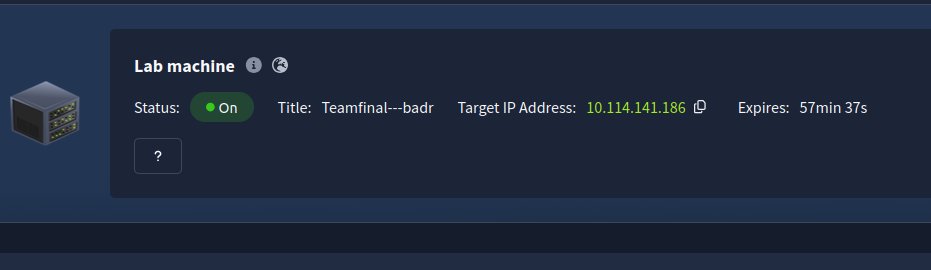
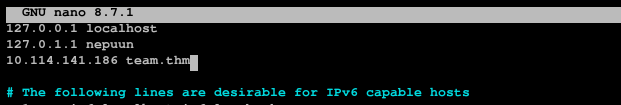
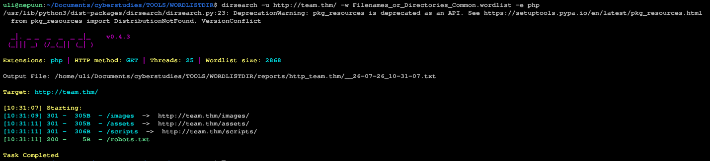
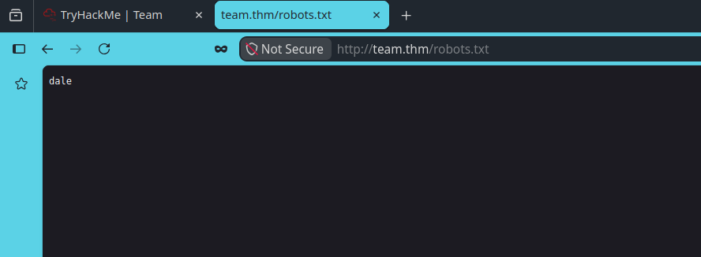
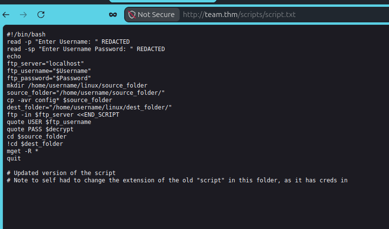
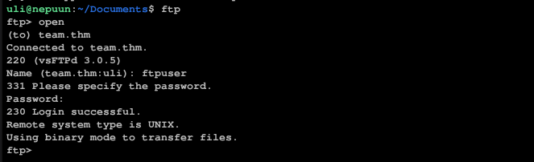
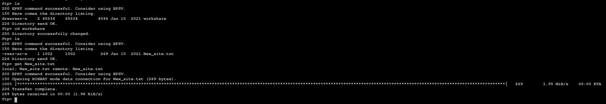
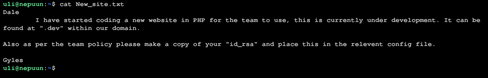
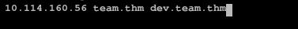

# TryHackMe - Team
Platform: Tryhackme
Category: Web Enumeration / Credential exposure / Linux priviledge escalation
Difficulty: Easy-Medium

## Summary

This room / CTF simulates a small internal "Team site" that leaks credentials through a forgotten backup file, then chains that access into SSH, sudo misuse, and a writable cron script to escalate to root. It's a good example of how a handful of small, individually "minor" misconfigurations (that being the forgotten .old file) can have a large impact in the end, and that being root access to admin. every step in this chain would have left a distinct trail in logs, which I've noted throughout.

## Tools used
dirsearch — initial directory enumeration
ffuf — targeted fuzzing on the /scripts/ path
ftp — retrieving files from an exposed FTP share
Browser LFI (script.php?page=) — reading local files off the dev vhost
ssh — authenticating with a recovered private key
python3 pty.spawn — shell stabilization
nc (netcat) — catching a reverse shell
nano — editing the writable cron script

## Objective 
Enumerate a web application, recover leaked credentials, pivot across two vhosts, and escalate from an unprivileged user to root.

## Set-up
if you're using the TryHackMe attack box, you can skip this section. Otherwise, to actually interact with the machine you're going to need to install openVPN from https://tryhackme.com/access and follow the steps to enable the VPN, secondly, you'll need to get the IP of the Lab machine and put it in your /etc/hosts file like the following:




## Process
### 1. Initial recon

we start off by looking for directories inside of http://team.thm/, we do so by running the following command

```bash
dirsearch -u http://team.thm/ -w Filenames_or_Directories_Common.wordlist -e php
```

You'll get the following directories



robots.txt has only "dale" in it, this is likely a username, so keep that name in mind



### 2. Fuzzing the scripts directory

the other directories (assets and images) aren't as significant as scripts, so we can focus on that

i ran the command

```bash
ffuf -u 'http://team.thm/scripts/FUZZ' -w Filenames_or_Directories_Common.wordlist -e .bak,.txt,.zip -mc 200,403
```

and everything was 403 for the most part (aka private) except for script.txt, reading script.txt, we find



the comment hints us to look for script.old, which if we try accessing http://team.thm/scripts/script.old, we'll have the file downloaded, however it cannot be viewed until we rename it to script.txt, and what we get is an older version of the script.txt file, this time including credentials for an ftp account.

### 3. Accessing FTP

using the recently obtained credentials, run the following set of commands
```bash
ftp
open
team.thm
[username]
[password]
```



running it will let us access the ftp, however you must keep in mind that the directory in which you're running that set of commands matters, as you'll sometimes not be able to use "get" on the files you want.

### 4. Getting the file

inside of the FTP account, navigate around using ls and cd, you'll eventually find New_site.txt, download New_site.txt by running:

```bash
get New_site.txt
```



printing the file will show us the following:



we're hinted towards a subdomain, http://dev.team.thm/, which is what we'll be using recon for now.

but before that, make sure to add dev.team.thm into /etc/hosts, much like how we did earlier during setup

<sub>The IP is different from last time because this screenshot was taken at a separate day than the day of setup.</sub>
