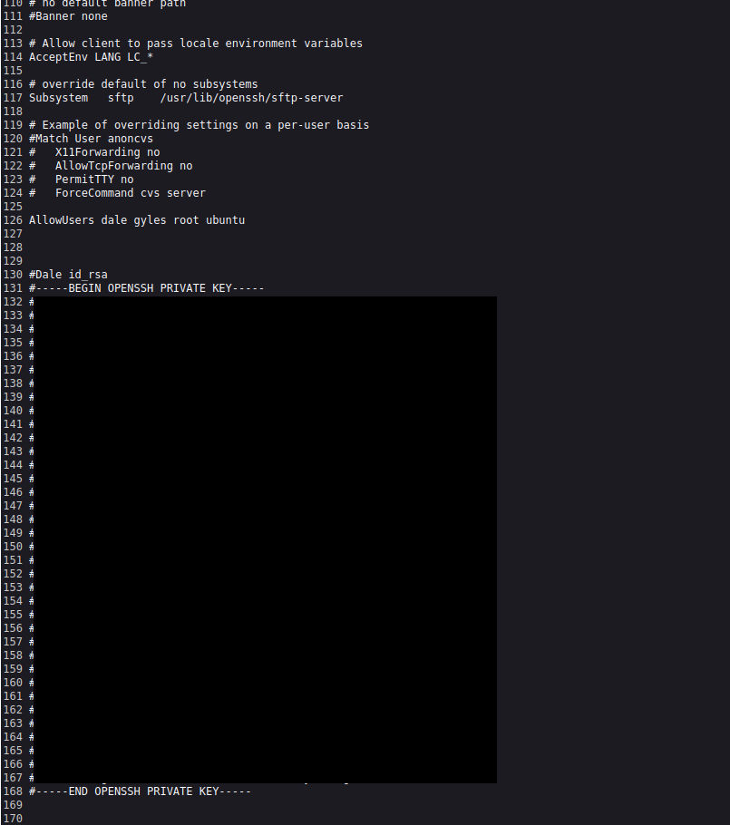
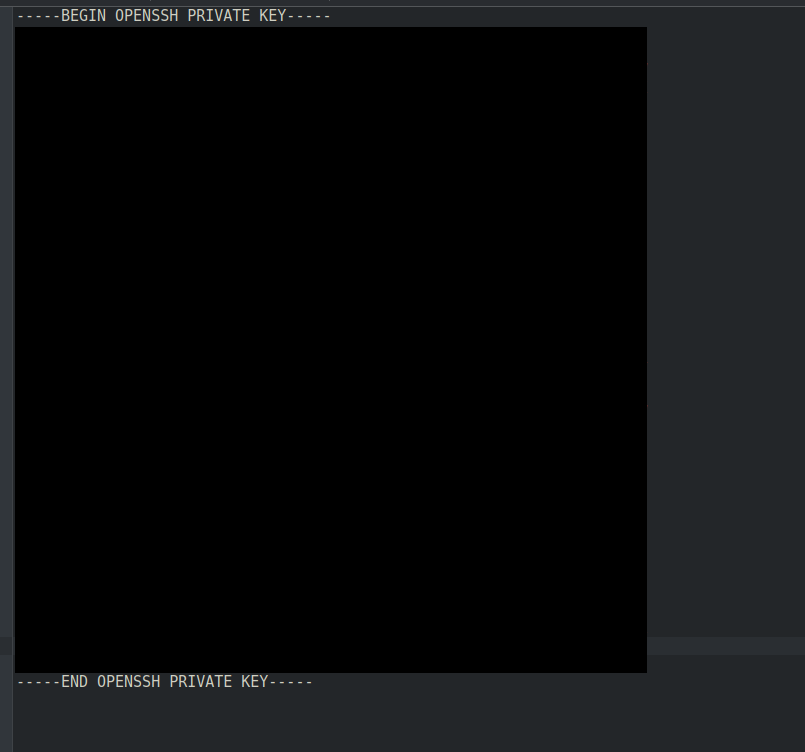
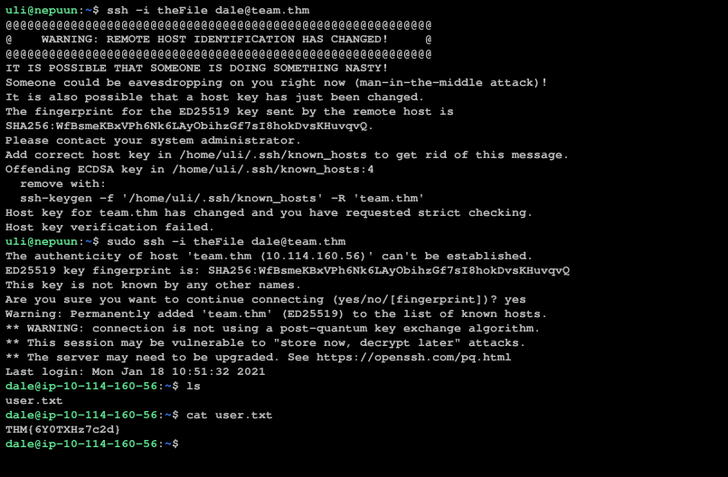

# TryHackMe - Team

**Platform:** TryHackMe
**Category:** Web Enumeration / Credential Exposure / Linux Privilege Escalation
**Difficulty:** Easy-Medium

## Summary

This room simulates a small internal "team site" that leaks credentials
through a forgotten backup file, then chains that access into SSH, sudo
misuse, and a writable cron script to escalate to root. It's a good example
of how a handful of small, individually "minor" misconfigurations, in this
case, a forgotten `.old` file can add up to a major impact, in this case
full root access. Every step in this chain would have left a distinct trail
in logs, which I've noted throughout.

## Tools Used

- `dirsearch` — initial directory enumeration
- `ffuf` — targeted fuzzing on the `/scripts/` path
- `ftp` — retrieving files from an exposed FTP share
- Browser LFI (`script.php?page=`) — reading local files off the dev vhost
- `ssh` — authenticating with a recovered private key
- `python3 pty.spawn` — shell stabilization
- `nc` (netcat) — catching a reverse shell
- `nano` — editing the writable cron script

## Objective

Enumerate a web application, recover leaked credentials, pivot across two
vhosts, and escalate from an unprivileged user to root.

## Set-up

If you're using the TryHackMe AttackBox, you can skip this section.
Otherwise, to interact with the machine you'll need to install OpenVPN from
[tryhackme.com/access](https://tryhackme.com/access) and follow the steps to
connect. Then, get the IP of the lab machine and add it to your
`/etc/hosts` file:


## Process

### 1. Initial recon

We start by looking for directories inside `http://team.thm/`:

```bash
dirsearch -u http://team.thm/ -w Filenames_or_Directories_Common.wordlist -e php
```

This turns up the following directories:


`robots.txt` contains only the word "dale", likely a username, worth
keeping in mind for later.


### 2. Fuzzing the scripts directory

Of the directories found, `/scripts/` is the most interesting 
`/images/` and `/assets/` are unlikely to hold anything actionable. Fuzzing
it directly:

```bash
ffuf -u 'http://team.thm/scripts/FUZZ' -w Filenames_or_Directories_Common.wordlist -e .bak,.txt,.zip -mc 200,403
```

Everything comes back 403 (blocked) except `script.txt`. Reading it:


A comment in the file hints at a `script.old`. Requesting
`http://team.thm/scripts/script.old` downloads the file, but it isn't
directly viewable until renamed to `script.txt` locally. Once renamed, it
turns out to be an older version of the script, this one including
credentials for an FTP account.

### 3. Accessing FTP

Using the recovered credentials:

```bash
ftp
open
team.thm
[username]
[password]
```


One thing to note: the directory you're running these commands from
matters — if `get` doesn't work on a file you're trying to pull, try moving
up a directory (`cd ..`) before reconnecting.

### 4. Retrieving the file

Inside the FTP session, navigating with `ls` and `cd` eventually surfaces
`New_site.txt`:

```bash
get New_site.txt
```


Reading the file:


It hints at a subdomain, `dev.team.thm`, which is where we'll focus recon
next. Before visiting it, add it to `/etc/hosts` the same way as during
setup:

<p align="center">
  
  <br>
  <em>The IP differs from the setup screenshot since this one was taken on a separate day.</em>
</p>

### dev subdomain

Inside dev.team.thm, we find a placeholder link for a teamshare, and the url will be http://dev.team.thm/script.php?page=teamshare.php

from the script.php?page=, we can find vital directories using another directory search after the '=', this time use a wordlist that is more relevant to LFI.

doing so will let you find ../../../etc/ssh/sshd_config, to be more specific, http://dev.team.thm/script.php?page=../../../etc/ssh/sshd_config. This will have an ssh key.



### SSH key

make a file with the key starting from the BEGIN OPENSSH PRIVATE KEY line down to END OPENSSH PRIVATE KEY line, and remove all the '#'

the file's contents should look like this 



### SSH connection

now, while keeping in mind of which directory you're running the command the following command

```bash
ssh -i [SSH File name] dale@team.thm
```

you'll get access to dale's files, which when you navigate, you'll find your first flag.


